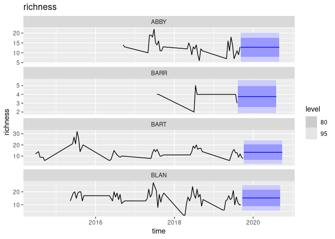
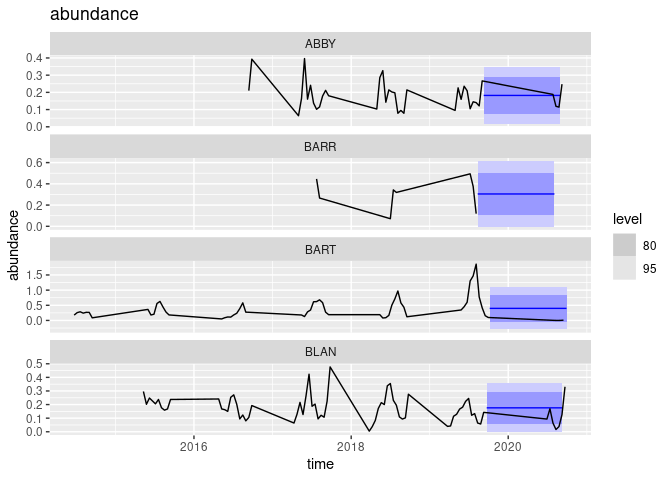
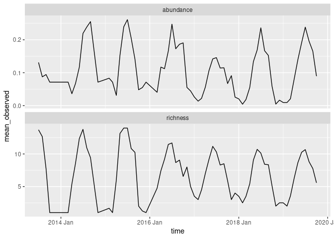
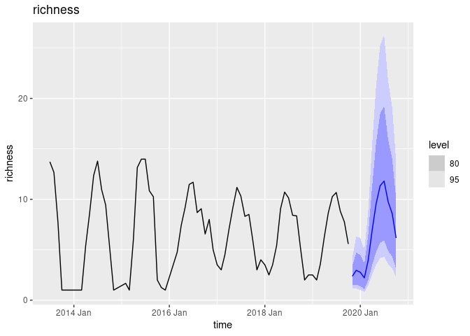
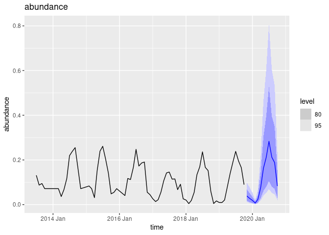

``` r
knitr::opts_chunk$set(message=FALSE)
```

``` r
library(neon4cast) # remotes::install_github("eco4cast/neon4cast")
library(tidyverse)
library(tsibble)
library(fable)
```

# Data Access

``` r
targets <-
  "https://data.ecoforecast.org/targets/beetles/beetles-targets.csv.gz" %>% 
  read_csv(col_types = "cDdd") %>% 
  as_tsibble(index = time, key = siteID)
```

For illustrative purposes, we will pretend most recent year is “future”
data. In practice, “past” would be the `targets` data.frame downloaded
on the day code is run (i.e. most recent data), while “future” would be
the “targets” data downloaded some period of time (i.e. 1 yr) after when
it is possible to test if the forecast was accurate.

``` r
past <-  targets %>% filter(time < max(time) - 365)
future <- targets %>% filter(time >= max(time) - 365)
```

## Compute a forecast

``` r
## Compute a simple mean/sd model per site... obviously silly given huge seasonal aspect
null_richness <- past  %>% 
  model(null = MEAN(richness)) %>%
  forecast(h = "1 year")

null_abundance <- past  %>%
  model(null = MEAN(abundance)) %>%
  forecast(h = "1 year")
```

## Visualize the forecast

``` r
first4 <- unique(null_richness$siteID)[1:4]

null_richness %>% filter(siteID %in% first4)  %>% autoplot(past) + ggtitle("richness")
```

<!-- -->

``` r
null_abundance %>% filter(siteID %in% first4)  %>% autoplot(targets) + ggtitle("abundance")
```

<!-- -->

## Score the forecast

`fable` can compute CRPS, by default computes averages by siteID (`key`)
and `.model` only.  
Optionally, we could include `by = c(".model", "siteID", "time")` to
generate separate forecasts by time. (For some reason `fable`s internal
method is much slower than the EFI code, though results are numerically
equivalent). Note that fable can work across multiple models, (though we
have only one in this case), but not across multiple target variables.
We must handle predictions of `richness` and `abundance` separately.
Recall that smaller CRPS scores are better.

``` r
null_richness %>%
  accuracy(future, list(crps = CRPS))
```

    ## Warning: The future dataset is incomplete, incomplete out-of-sample data will be treated as missing. 
    ## 67 observations are missing between 2019-05-27 and 2020-10-05

    ## # A tibble: 47 x 4
    ##    .model siteID .type    crps
    ##    <chr>  <chr>  <chr>   <dbl>
    ##  1 null   ABBY   Test    1.17 
    ##  2 null   BARR   Test  NaN    
    ##  3 null   BART   Test  NaN    
    ##  4 null   BLAN   Test    3.38 
    ##  5 null   BONA   Test    0.714
    ##  6 null   CLBJ   Test  NaN    
    ##  7 null   CPER   Test    1.17 
    ##  8 null   DCFS   Test  NaN    
    ##  9 null   DEJU   Test    1.64 
    ## 10 null   DELA   Test  NaN    
    ## # … with 37 more rows

## EFI Formatting

EFI requires a flat-file format for forecasts that avoids the use of
complex list columns.  
To convey uncertainty, forecasts must be expressed either by giving mean
and standard deviation (for predictions that are normally distributed)
or must express forecasts as an ensemble of replicate draws from
forecast distribution. The helper function `efi_format()` handles this
transformation.

``` r
## Combine richness and abundance forecasts. drop the 'model' column
null_forecast <- inner_join(efi_format(null_richness), 
                            efi_format(null_abundance)) %>%
  select(!.model) # we have only one model
```

Score the forecast using EFI’s internal method. By default, EFI’s method
reports the score every unique site-time combination (unique grouping
variables). It is easy to later average across times for a by-site
score.

``` r
scores_null <- neon4cast::score(null_forecast, "beetles")
# average richness scores by site
scores_null %>% group_by(target,siteID) %>% summarise(mean = mean(score, na.rm=TRUE)) %>% filter(target=="richness")
```

    ## # A tibble: 34 x 3
    ## # Groups:   target [1]
    ##    target   siteID    mean
    ##    <chr>    <chr>    <dbl>
    ##  1 richness ABBY     1.17 
    ##  2 richness BART   NaN    
    ##  3 richness BLAN     3.38 
    ##  4 richness BONA     0.714
    ##  5 richness CPER     1.17 
    ##  6 richness DCFS   NaN    
    ##  7 richness DEJU     1.64 
    ##  8 richness DSNY   NaN    
    ##  9 richness GRSM     1.50 
    ## 10 richness GUAN   NaN    
    ## # … with 24 more rows

# Richer forecast models

In both richness and abundance, we will treat gaps as missing data, not
as zeros.

``` r
gap_filled <- tsibble::fill_gaps(past)
arima_richness <- gap_filled  %>% 
  model(arima = ARIMA(richness)) %>%
  forecast(h = "1 year") %>%
  efi_format()

arima_abundance <- gap_filled  %>%
  model(arima = ARIMA(abundance)) %>%
  forecast(h = "1 year") %>%
  efi_format()
```

    ## Warning in sqrt(diag(best$var.coef)): NaNs produced

    ## Warning in sqrt(diag(best$var.coef)): NaNs produced

``` r
## Combine richness and abundance forecasts. drop the 'model' column
arima_forecast <- inner_join(arima_richness, arima_abundance) %>% select(!.model)
```

Score the forecast

``` r
arima_scores <- neon4cast::score(arima_forecast, "beetles")
arima_scores %>% group_by(target) %>% summarise(mean = mean(score, na.rm=TRUE))
```

    ## # A tibble: 2 x 2
    ##   target     mean
    ##   <chr>     <dbl>
    ## 1 abundance 0.638
    ## 2 richness  8.79

# Process vs Noise

Individual sites and weeks are pretty noisy. In contrast, averaging by
month over all sites nationally creates a strong periodic pattern:

``` r
national_ave <- past %>%
  index_by(Time = ~ yearmonth(.)) %>% # temporal aggregates
  summarise(
    richness = mean(richness, na.rm = TRUE),
    abundance = mean(abundance, na.rm = TRUE)
  ) %>% rename(time = Time)


national_ave %>% 
  pivot_longer(c("richness", "abundance"), 
               names_to = "variable", 
               values_to="mean_observed") %>% 
  ggplot(aes(time, mean_observed)) + geom_line() +
  facet_wrap(~variable, ncol = 1, scales = "free_y")
```

<!-- -->

An ARIMA model is a good way to capture this periodic trend. We will use
log-transforms as a simple way to avoid the possibility of negative
values in our predictions.

``` r
ave_richness <- national_ave %>%
  fill_gaps() %>%
  model(arima = ARIMA(log(richness))) %>%
  forecast(h = "1 year")

ave_richness %>% autoplot(national_ave) + ggtitle("richness")
```

<!-- -->

``` r
ave_abund <- national_ave %>%
  fill_gaps() %>%
  model(arima = ARIMA(log(abundance))) %>%
  forecast(h = "1 year")

ave_abund %>% autoplot(national_ave) + ggtitle("abundance")
```

<!-- -->

Can we use this as a basis to generate site-level forecasts? Of course.
We treat the sites as merely random draws from this national pool,
weighted by the fraction that each site has contributed to the grand
total observed richness. (Obviously this leaves something to be desired
in terms of relevant biology.)

``` r
richness_weights <- 
  past %>% as_tibble() %>% 
  group_by(siteID) %>% 
  summarise(richness_share = sum(richness, na.rm=TRUE)) %>% 
  mutate(richness_share = richness_share / sum(richness_share))
richness_weights
```

    ## # A tibble: 47 x 2
    ##    siteID richness_share
    ##    <chr>           <dbl>
    ##  1 ABBY          0.0221 
    ##  2 BARR          0.00152
    ##  3 BART          0.0373 
    ##  4 BLAN          0.0480 
    ##  5 BONA          0.00238
    ##  6 CLBJ          0.0131 
    ##  7 CPER          0.0453 
    ##  8 DCFS          0.0188 
    ##  9 DEJU          0.00628
    ## 10 DELA          0.0208 
    ## # … with 37 more rows

``` r
# Note distribution is normal in log-transformed variable
ave_richness %>% 
    dplyr::mutate(sd = sqrt( distributional::variance( richness ) ) ) %>%
    dplyr::rename(mean = .mean) %>%
    dplyr::select(time, .model, mean, sd) %>%
    tidyr::pivot_longer(c(mean, sd), names_to = "statistic", values_to = "richness") %>%
    dplyr::as_tibble()
```

    ## # A tibble: 24 x 4
    ##        time .model statistic richness
    ##       <mth> <chr>  <chr>        <dbl>
    ##  1 2019 Nov arima  mean         2.37 
    ##  2 2019 Nov arima  sd           0.740
    ##  3 2019 Dec arima  mean         2.96 
    ##  4 2019 Dec arima  sd           1.23 
    ##  5 2020 Jan arima  mean         2.76 
    ##  6 2020 Jan arima  sd           1.21 
    ##  7 2020 Feb arima  mean         2.21 
    ##  8 2020 Feb arima  sd           0.967
    ##  9 2020 Mar arima  mean         3.93 
    ## 10 2020 Mar arima  sd           1.72 
    ## # … with 14 more rows

# Including additional driver data

A richer forecast may make use of NOAA weather predictions.

``` r
#sites <- unique(targets$siteID)
#lapply(sites, neon4cast::download_noaa, dir = neonstore::neon_dir())
#noaa <- neon4cast::stack_noaa()
```

In calibrating our model, we can use NEON’s local measurements of the
meteorological variables.

``` r
# Summary statistics for fixed-location sites:
#neonstore::neon_download("DP4.00001.001")
#neonstore::neon_store(product = "DP4.00001.001")
# 
```
